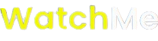
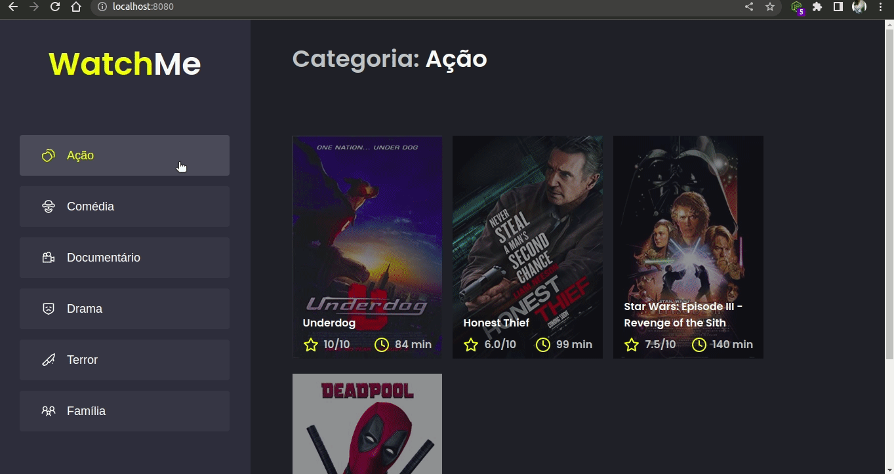

<div align="center">
  
</div>
<h5 align="center">
  O melhor do cinema pra você!
</h5>

<br/>

<p align="center">
  
  
  
  
</p>
<br>

<p align="center">
  <a href="#sobre">Sobre</a> •
  <a href="#watchMe">WatchMe</a> •
  <a href="#instalação">Instalação</a> •
  <a href="#tecnologias">Tecnologias</a> •
  <a href="#autor">Autor</a>  
</p>

<br><br><br>

## Sobre

<p>
  Projeto desenvolvido durante o Ignite, um bootcamp criado pela <strong><a href="https://rocketseat.com.br/">Rocketseat</a></strong> com diversas trilhas de variadas tecnologias. O projeto foi criado durante o módulo III do bootcamp na trilha de <strong><a href="https://pt-br.reactjs.org/">ReactJS</a></strong>.
</p>

## WatchMe

O WatchMe é uma aplicação cujo objetivo é listar filmes por categorias. Para esse projeto foram selecionadas algumas categorias e filmes que pertencem a cada uma delas para consolidar e praticar o conhecimento nos fundamentos do React.
A aplicação utiliza uma API fake criada com JSON server e renderiza os filmes retornados na tela conforme GIF abaixo:



## Instalação

Antes de começar, você vai precisar ter instalado em sua máquina as seguintes ferramentas:
[Git](https://git-scm.com), [Node.js](https://nodejs.org/en/).
Além disto é bom ter um editor para trabalhar com o código como [VSCode](https://code.visualstudio.com/).

### 🖥 Rodando o projeto

```bash
# Clone este repositório
$ git clone git@github.com:MrRioja/watchMe.git

# Acesse a pasta do projeto no terminal/cmd
$ cd watchMe

# Instale as dependências
$ npm install
# Caso prefira usar o Yarn execute o comando abaixo
$ yarn

# Antes de executarmos o projeto, vamos executar a API feita com JSON server em um terminal
$ yarn server

# Por fim, basta executar o projeto em React com o comando abaixo em outro terminal
$ yarn dev

# A aplicação estará disponível localmente e conectada com a nossa API - acesse <http://localhost:8080>
```

## Tecnologias


<br><br><br><br><br><br>

## Autor

<div align="center">

<h1>Luiz Rioja</h1>
<strong>Backend Developer</strong>
<br/>
<br/>

<a href="https://linkedin.com/in/luizrioja" target="_blank">

</a>

<a href="https://github.com/mrrioja" target="_blank">

</a>

<a href="mailto:lulyrioja@gmail.com?subject=Fala%20Dev" target="_blank">

</a>

<a href="https://api.whatsapp.com/send?phone=5511933572652" target="_blank">

</a>

<a href="https://join.skype.com/invite/tvBbOq03j5Uu" target="_blank">

</a>

<br/>
<br/>
</div>
